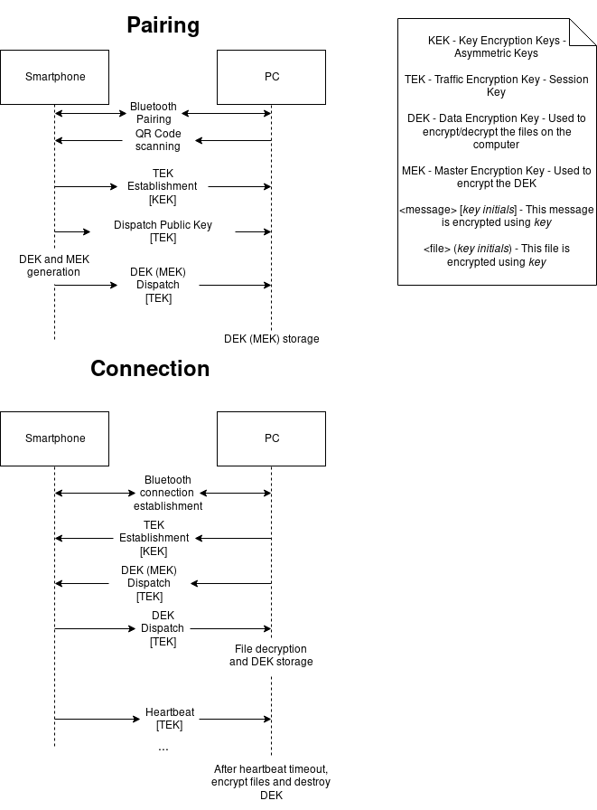

{ width=30% } 

{ width=30% }

{ width=30% }

\newpage

# Problem

After pairing the phone with the computer, keys are generated and certain files on the computer can be encrypted when the phone is not connected to it. A phone is connected when near to the computer through the exchange of a token.

We need to ensure that:

  * the paired computer files can only be decrypted with the paired phone’s presence, so attackers can’t fake 
    the phone’s presence.

  * the phone only sends the token to the paired computer,
    so attackers can’t fake the computer’s presence. Otherwise the fake computer can get
    the token and use a fake phone to decrypt the files.

  * the key exchange (token) is secure because if the attacker is listening and gets
    the exchanged message by the phone he cannot get the keys to decrypt the files.
  * token needs to be unique to avoid replay attacks.
  * the key storage needs to be secure so that if the device keeping the keys is
    compromised the attacker cannot get the keys to decrypt the files.
 
Problem being solved:

Only those with access to both the paired phone and computer can access the encrypted files.

# Requirements

  #. Confidentiality (only the paired computer can read the token)
  #. Authentication of origin (the paired computer only accepts tokens sent by the paired phone)
  #. Fault tolerance (if the computer crashes when the computer is connected, the files cannot be left unprotected)

# Solution

During the initial pairing, the PC creates and displays its RSA public key in a QR code on the screen.
The phone scans this key and stores it. Then, it generates and sends an AES-256 session key and 
sends it encrypted with the PC’s public key. Afterwards, using that key for encrypting the traffic,
it sends its own public key, which is stored by the PC to be used as a Key Encryption Key.
This serves as a protection from man-in-the-middle attacks.

The phone generates two other AES-256 keys, one to be used for file encryption, and one to encrypt that key before sending it to the PC.
This key is stored, and the pairing process is completed.

After pairing, the phone can connect to the PC, who (after the initial session key exchange) sends the
encrypted File Encryption key, which is securely stored on the PC. The phone decrypts it and sends it
back to the PC, who uses it to decrypt the files. The phone then has to keep sending heartbeats (which
include a nonce to avoid replay attacks) so that the PC can know the phone is in range. After the phone
is disconnected, since the PC no longer receives heartbeats, it encrypts the files again and deletes
the FE key from storage, keeping only its encrypted copy. The PC maintains a log of the operations it
performs. In case of a crash, after recovery it will encrypt all the files with the decrypted FE key,
then deletes the key and waits for the phone to be reconnected.

See figure \ref{sol_diagram} for information.
 
Basic

:  Initial implementation without fault tolerance and secure channels.
 
Intermediate

: Implementation of confidentiality with secure channels.
 
Advanced

: Implementation of fault tolerance.

# Results

The entirety of the proposed solution was implemented in separate Android and
Python applications. It was thoroughly tested and successfully recovered from
faults, and files were successfully encrypted and decrypted while the phone was
in range/out of range (respectively).

All encrypted data (except for any session key exchanges, with use RSA-OAEP with
2048 bit keys) is encrypted using AES-256 in EAX mode.

The used architecture is described in the annexed figure \ref{uml}.

# Evaluation

Although the application itself is secure, it assumes a certain level of responsibility
on the user's side. The user needs to remember at least one password, if they use the
same password on the phone and the PC (which is not the recommended way to do it), or
potentially two passwords, if they choose to be cautious and use different passwords for
both devices. If either of these passwords is forgotten, the files are irrecoverably lost.

It is also vulnerable to an attacker that gains access to the configuration folder and its
contained files. Although that attacker can't retrieve the keys from these files alone
without knowing the password, they can delete the files, resulting in the user losing their
keys. This can be mitigated by keeping backups of the configuration folder whenever it gets
modified, however.

If the attacker manages to crash the program while the files are encrypted, they are left in
a vulnerable state until the program is restarted and the password is inputted. They are
immediately re-encrypted as soon as the program is restarted, however, which is good enough
for the general case where the user's PC might crash while the program is running and they
want to make sure the files are protected when the PC gets turned back on. We consider that
if the attacker has access to the computer while the files are decrypted, they can already
copy the files anyway, so this is beyond the scope of the application.

Finally, the attacker might jam the Bluetooth connection and prevent the computer from
receiving any messages from the phone. This would result in the computer being unable
to decrypt the files (**Denial of Service** attack).

Besides these vulnerabilities, the application ensures, as said in the [**requirements**](#requirements)
section, confidentiality, authenticity, and fault tolerance:

   * It is protected from replay attacks, since heartbeats carry nonces
   * The session is always encrypted and
authenticated using AES EAX mode, so the attacker can't tamper with heartbeats to fake a new nonce.
   * Every configuration file is encrypted using the user's password (which may be different on each
device), so even if an attacker manages to get these files, they can't get the keys.

# Conclusion

Overall, the project was implemented as expected. Although it doesn't have the best interface,
which is not within the scope of this course, it fulfills its purpose successfully and securely.

Achieving interoperability between the two different environments was challenging, but it allowed us
to learn more.

# References

## Tools used

  * Git
  * Java 8
     - Android Studio
  * Python 3.6
     - PyCharm

## Libraries used

### Python

   * qrcode
   * typing
   * pybluez
   * pyyaml
   * pypubsub
   * pycryptodomex
   * appdirs

### Java
   * spongycastle
   * zxing

\newpage

# Annex

{ height=100% }

{ height=100% }

